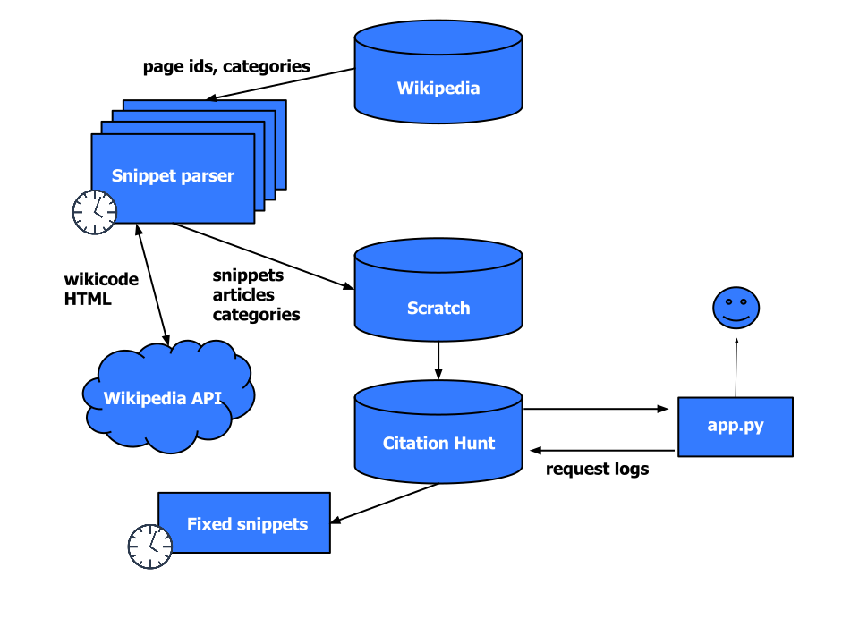

<!-- pandoc -i slides.md -t revealjs -s -o slides.html -V theme:white --!>

How can I begin to edit Wikipedia?

---

Easy, uncontroversial, but still **interesting**

Citations![citation needed]

---

\#1lib1ref

---

“As part of the **Wikipedia 15** birthday celebration (#Wikipedia15) in January 2016,
the Wikipedia Library team (@WikiLibrary) ran a **social media campaign** asking
librarians all over the world to **Imagine a World where Every Librarian Added
One More Reference to Wikipedia.** We called it **#1lib1ref.**”

[https://blog.wikimedia.org/2016/04/25/engaging-librarians-1lib1ref/](https://blog.wikimedia.org/2016/04/25/engaging-librarians-1lib1ref/)

---

“The combination of [Citation Needed] templates and the Citation Hunt tool
created a really low participation threshold. (...) Moreover, these tools
**facilitate a behaviour common amongst librarians: chasing information in
reference materials** (this is a core part of reference librarian training).”

[https://meta.wikimedia.org/wiki/The_Wikipedia_Library/1Lib1Ref/Lessons](https://meta.wikimedia.org/wiki/The_Wikipedia_Library/1Lib1Ref/Lessons)

---

“We need more **simple, gamified** but substantive models for contributing to
Wikipedia. **Citation Hunt was an excellent tool for engaging librarians**, and
we have received feedback from librarians that the small action made the biggest
difference for their participation.”

[https://meta.wikimedia.org/wiki/The_Wikipedia_Library/1Lib1Ref/Lessons](https://meta.wikimedia.org/wiki/The_Wikipedia_Library/1Lib1Ref/Lessons)

---

Other users:

- [WikiEdu](https://wikiedu.org)

- Various editathons

- Wikipedia links (e.g., [WP:Citation_needed](https://en.wikipedia.org/wiki/WP:Citation_needed))

---

Some English numbers:

> - Typical day: 5-10 citations, ~500 snippets viewed
> - \#1lib1ref 2017: 50-70 citations/day, for 3 weeks!
> - **Largest** referrer: en.wikipedia.org
> - **Best** referrer: wikiedu.org (anecdotally)

[https://tools.wmflabs.org/citationhunt/en/stats.html](https://tools.wmflabs.org/citationhunt/en/stats.html)

---

Technical review

---

---

The snippet parser

- Extract snippets or full sections

- HTML (Wikipedia API) output, annotated with custom CSS classes

- Powered by [mwparserfromhell](https://github.com/earwig/mwparserfromhell/) and
  a lot of hackery

---

Future direction

---

The immediate stuff:

- More languages

- Improve detection of fixed snippets [#70](https://github.com/eggpi/citationhunt/issues/70)

- UI glitches ([#73](https://github.com/eggpi/citationhunt/issues/73))

---

Longer term:

- Prevent [citogenesis](http://en.wikipedia.org/wiki/WP:CITOGENESIS)? Bad sources?

- More gamification mechanics?
    - \#1lib1ref 2017: Competition between libraries

- Campaigns on special dates throughout the year?

- Generalize to other kinds of templates and backlog

---

[https://tools.wmflabs.org/citationhunt](https://tools.wmlabs.org/citatinohunt)

[http://ggp.name/citationhunt/wikicite2017/slides.html](http://ggp.name/citationhunt/google/slides.html)

[github.com/eggpi/citationhunt](https://github.com/eggpi/citationhunt)
